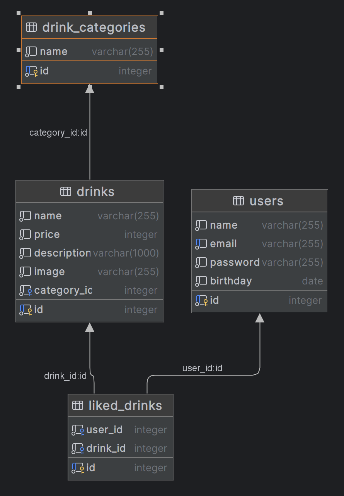

# Desafio tecnico Faster

> Esse README é um guia geral de como executar os projetos, documentações e informações relevantes estão nos READMES das suas respectivas partes

- [Frontend](./frontend/README.md)
- [Backend](./backend/README.md)

## Como rodar:

> Importante: Sempre rode o comando `docker compose up -d` e garanta que na execução nem a porta 3000 nem a 3001 estão sendo usadas por outro processo/container

### Iniciar container:

``docker compose up -d (ou docker-compose up -d dependendo da versão)``

### Iniciar backend:
1. `cd backend`
2. `npm run docker:bash`
3. `npm run project:first-setup`
4. `npm run start:dev`

### Iniciar frontend:
1. `cd frontend`
2. `npm run docker:bash`
3. `npm run project:first-setup`
4. `npm run dev`

### Resultados esperados

o [Frotend](http://localhost:3001/) estará ativo na porta 3001 do localhost e o [Backend](http://localhost:3000) vai estar ativo na 3000

## Documentação geral

Este projeto é feito em Nuxt + Typescript para o frontend e com Express + Typescript no backend dessa forma temos uma aplicação type-safe construida sobre uma arquitetura MVC, além disso o sistema conta com um banco de dados com postgresql, as entidades descritas na regra de negocio foram mapeadas da seguinte forma:
