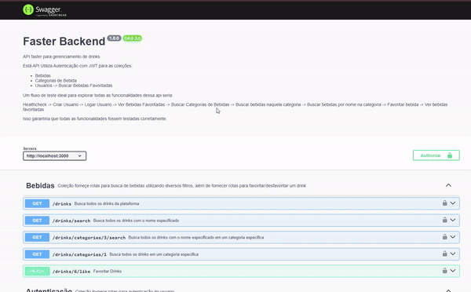
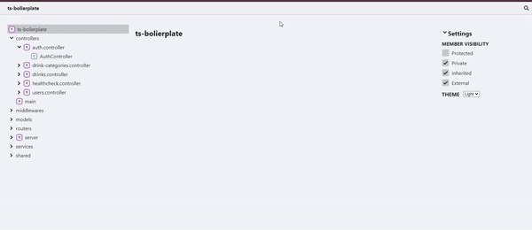

# Desafio Faster Backend

Bem-vindo ao Desafio Faster Backend, uma API que facilita a criação de perfis de usuário, autenticação e busca de bebidas, incluindo a opção de favoritar bebidas. Este projeto é voltado para desenvolvedores que buscam uma solução backend robusta para gerenciar usuários e dados relacionados a bebidas.

## Visão Geral

O objetivo principal do projeto é fornecer um backend MVC eficiente para criar e gerenciar perfis de usuários, autenticação segura e funcionalidades relacionadas a bebidas. Algumas funcionalidades chave incluem:

- **Criação de Perfil:** Os usuários podem criar perfis facilmente.
- **Autenticação Segura:** Sistema seguro de autenticação para proteger informações sensíveis.
- **Busca de Bebidas:** Recursos para buscar categorias e bebidas específicas.
- **Favoritos:** Os usuários podem marcar bebidas como favoritas.

## Documentação

Explore as documentações para entender melhor como usar a API:

- **Documentação Externa:** [Documentação Externa](http://localhost:3000/docs/public)
  
- **Documentação Interna:** [Documentação Interna](http://localhost:3000/docs/private)
  

## Como Rodar o Projeto

Siga estes passos para configurar e iniciar o projeto:

1. Execute `npm run docker:dev` para iniciar os containers.
2. Use `npm run docker:bash` para entrar no container.
3. Dentro do container, execute `npm install` para instalar as dependências.
4. Execute `npm run db:push` para criar o banco de dados.
5. Em seguida, use `npm run db:generate` para gerar tabelas.
6. Popule as tabelas com `npm run db:seed`.
7. Inicie o servidor local com `npm run start:dev`.

Para rodar em produção, utilize `npm run build` e, em seguida, `npm run start:prod`.

Explore, experimente e aproveite o Desafio Faster Backend!

